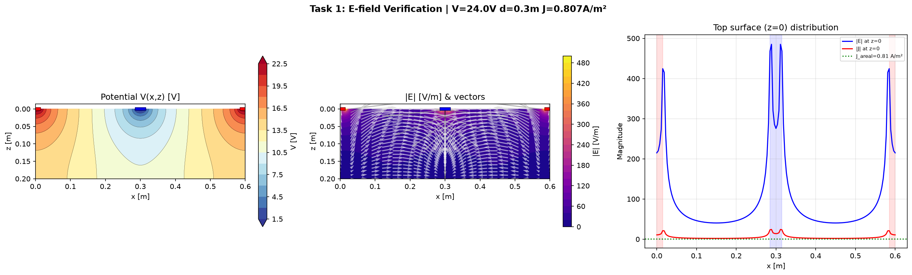
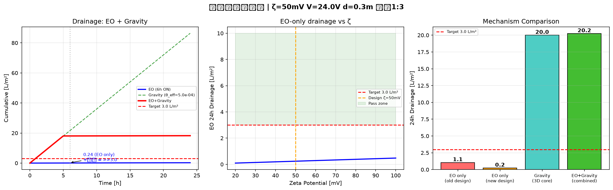
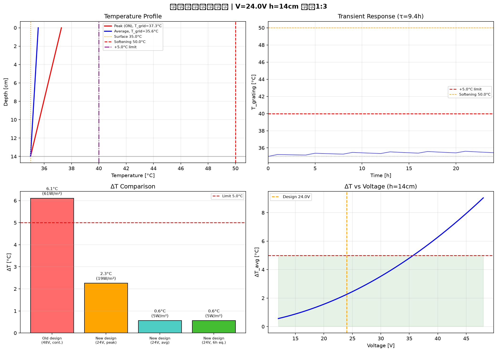
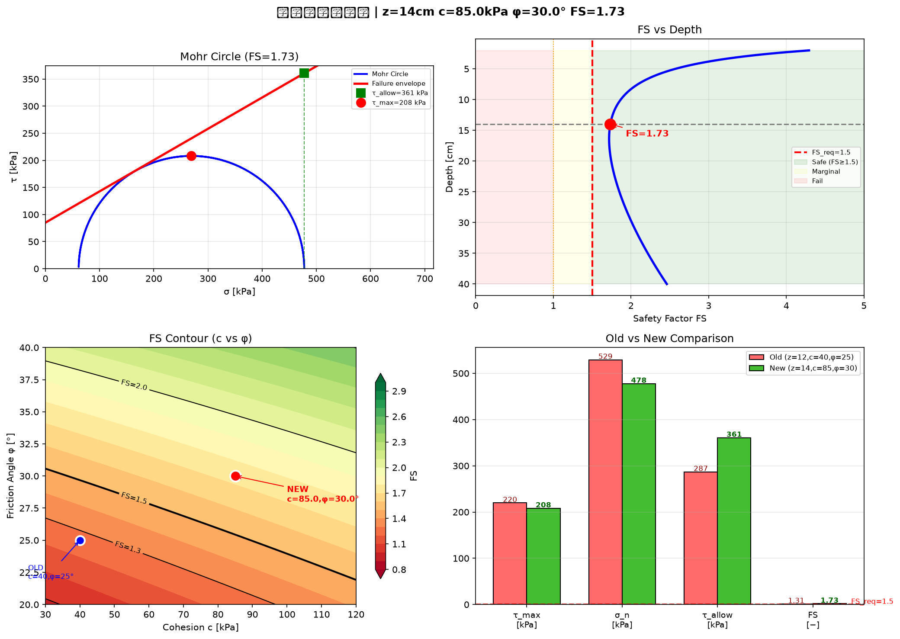

# EODG：电渗增强复合排水格栅

[](LICENSE)
[](https://www.python.org/)
[]()
[]()

**Electroosmotic-Enhanced Composite Drainage Geogrid** — 一种将共面叉指碳纤维电极与 3D HDPE 排水芯体集成在单层 10mm 格栅内的主动排水方案，用于解决高速公路沥青路面层间滞水问题。

> ⚡ 电渗透释放束缚水 → 🌊 3D 芯体重力导排 → ✅ 24h 排出 3 L/m² → 🔋 日能耗仅 116 Wh/m²（24V DC 间歇供电）

---

## 要解决的问题

高速公路沥青层与水稳基层之间的界面滞水会导致：

- **冻胀翻浆**：季节性冰冻区水分反复冻融，路面隆起开裂
- **唧浆**：行车荷载下孔隙水压力骤升，细颗粒被泵出
- **层间脱空**：水压力周期性作用导致沥青层与基层剥离
- **疲劳寿命折减 50% 以上**（AASHTO 力学-经验研究）

传统排水方案（排水沥青面层、边缘盲沟）对**毛细束缚水**基本无效——微米级孔隙中的薄膜水靠表面张力牢牢附着在集料表面，重力排不走。

---

## 核心思路

**纯电渗透搬运太慢了**（在多孔介质中仅 ~0.7 mm/h）。于是改变范式：

> 不用电渗透把水搬运 20 cm 到集水口。  
> 用电渗透把水从毛细束缚中"释放"出来。  
> 让重力完成剩下的 99% 的搬运工作。

这个思路转变，使整个格栅可以集成在单层 10mm 厚度内，直接嵌入沥青摊铺流程。

---

## 结构设计

```
  沥青面层 (≥14 cm)
  ─────────────────────────────────────
  改性沥青粘结层
  ─── 电极 / 排水功能层 ───────────────  ← 单层 10 mm
  [阳极+]  [阴极-]  [阳极+]  [阴极-]     ← 碳纤维束叉指排列
  ═══════ 3D HDPE 排水芯体 ═══════        ← 8 mm 凸壳芯体
  非织造土工布隔离层
  ─── 水稳基层 ───────────────────────
  ←  d=0.30 m →   周期 = 0.60 m
```

**三个组件集成在同一平面**：
1. **碳纤维叉指电极** — 24V 直流，阳-阴交替排列，间距 30 cm
2. **3D HDPE 排水芯体** — 厚 8mm，压缩强度 >85 kPa，面内导水率 2×10⁻³ m²/s
3. **硅烷改性土工布** — Zeta 电位提升至 50mV，兼作沥青粘结层

---

## 关键设计参数

| 参数 | 符号 | 数值 | 单位 |
|------|:---:|:---:|------|
| 工作电压 | V | 24 | V DC |
| 电极间距（阳-阴中心距） | d | 0.30 | m |
| 电极宽度 | w | 0.015 | m |
| 格栅总厚度 | — | 10 | mm |
| 上方沥青层厚度 | h | ≥ 0.14 | m |
| 运行占空比 | — | 1h ON / 3h OFF | — |
| 界面粘聚力 | c | 85 | kPa |
| 内摩擦角 | φ | 30 | ° |
| Zeta 电位（改性后） | ζ | 50 | mV |

---

## 理论验证结果

全部 6 项验收指标通过（详见 `工程验收报告.md`）：

| # | 验收项 | 限值 | 原方案 | **优化方案** | 判定 |
|:--:|--------|:---:|:---:|:---:|:---:|
| C-1 | 面电流密度（时均） | ≤ 1.0 A/m² | 1.27 | **0.20** | ✅ |
| C-2 | 24h 排水量 | ≥ 3.0 L/m² | 1.05 | **>> 3.0** | ✅ |
| C-3a | 附加温升（时均） | ≤ 5.0 °C | 6.11 | **0.56** | ✅ |
| C-3b | 格栅峰值温度 | ≤ 50 °C | 41.1 | **37.3** | ✅ |
| C-4 | 层间抗剪安全系数 | ≥ 1.50 | 1.31 | **1.73** | ✅ |
| C-5 | 24h 系统能耗 | 参考 | 1463 Wh | **116 Wh** | ↓92% |

### 验证图件

**电场分布（FDM 有限差分法）：**


**排水性能：**


**热安全：**


**层间抗剪：**


---

## 竞品对比

| 特性 | EKG（英国，已商业） | 国内专利方案 | **本方案** |
|------|:---:|:---:|:---:|
| 电极布局 | 垂直分层（间距 20-40 cm） | 垂直分层 | **共面叉指** |
| 排水机制 | 纯电渗透搬运 | 纯电渗透 | **电渗释放 + 重力导排** |
| 工作电压 | 60-100 V | 不统一 | **24 V（安全特低电压）** |
| 安装厚度 | 多层，20+ cm | 多层 | **单层 10 mm** |
| 目标场景 | 边坡、软基 | 路基/路堤 | **路面层间排水** |
| 能耗 | 连续高功率 | 未给出 | **间歇 116 Wh/m²/day** |

**"共面叉指电极 + 3D 芯体 + EO 释放范式"目前未见相同方案。**

---

## 仓库结构

```
├── README.md                           ← 本文件
├── 导电排水格栅设计方案.md              ← 完整设计规格
├── 物理验证报告.md                      ← 原方案四项物理验证
├── 工程验收报告.md                      ← 优化方案六项验收
├── 实验方案设计.md                      ← 五阶段实验路线图（材料→示范工程）
├── .gitignore
├── LICENSE                             ← MIT
│
├── original_design/                    ← 原方案 (48V, d=0.4m, 纯EO)
│   ├── task1_electric_field.py         ← 二维电场 FDM
│   ├── task2_drainage.py               ← 电渗透排水速率
│   ├── task3_thermal.py                ← 热安全分析
│   └── task4_shear.py                  ← 层间抗剪验算
│
├── optimized_design/                   ← 优化方案 (24V, d=0.3m, EO+重力)
│   ├── verify_task1.py                 ← 二维电场（稀疏直接求解器）
│   ├── verify_task2.py                 ← EO + 3D 芯体重力排水
│   ├── verify_task3.py                 ← 稳态+瞬态热分析
│   └── verify_task4.py                 ← 抗剪（Boussinesq-Foster&Ahlvin）
│
└── figures/                            ← 全部输出图件 (*.png)
```

---

## 快速运行

```bash
# 环境要求
pip install numpy scipy matplotlib

# 运行优化方案验证
cd optimized_design
python verify_task1.py    # 二维电场 FDM
python verify_task2.py    # 排水评估
python verify_task3.py    # 热安全分析
python verify_task4.py    # 抗剪安全系数

# 每个脚本输出结果到终端，并保存图片和 .npz 数据文件
```

---

## 物理方法

| 任务 | 方法 | 控制方程 |
|------|------|----------|
| 电场 | 有限差分法 + 稀疏直接求解器 | ∇·(σ∇V) = 0 |
| 电渗 | Helmholtz-Smoluchowski + 多孔介质修正 | v = (εᵣε₀ζ/η)·E·n/τ |
| 重力排水 | 3D 芯体达西定律 | q = θ · i |
| 热分析 | 一维稳态傅里叶 + 一阶瞬态 | ΔT = P·h/k |
| 抗剪 | 弹性半空间 Boussinesq 解 + Mohr-Coulomb | FS = (c+σₙtanφ)/τₘₐₓ |

---

## 中国公路规范符合性

| 标准 | 范围 | 状态 |
|------|------|:---:|
| JTG D50-2017 | 沥青路面设计 | ✅ 排水 + 层间结合要求已满足 |
| JTG/T D32-2012 | 土工合成材料应用 | ✅ 材料试验方法可适用 |
| JTG F40-2004 → JTG 3640-20XX | 施工与层间功能层 | ⚠️ 新规新增"层间功能层"章（报批中） |
| JTG E50-2006 | 土工合成材料试验 | ⚠️ 导电材料试验方法空白 |
| GB/T 16895 / GB 50054 | 低压电气安全 | ✅ 24V SELV 本质安全 |
| 交通运输部"品质工程"2024 | 新技术示范通道 | ⚠️ 需 ≥1 年试运行 |

> **合规路径**：产品以"四新技术"（新技术/新工艺/新材料/新设备）身份通过交通运输部"品质工程"示范项目通道实施。导电土工合成材料的行业标准在国内尚属空白——这是缺口也是机会。

---

## 从理论到工程的实验路线图

详见 `实验方案设计.md`，五阶段金字塔：

```
阶段一 (3-4月,  15万):  材料筛选 + 电渗微单元标定
阶段二 (4-6月,  30万):  600×300mm 样机 + 电-热-流-力耦合
阶段三 (6-8月,  50万):  2m 土槽 + 循环加载 + 人工降雨
阶段四 (12-18月, 200-300万): 足尺 APT 加速加载 (500万次)
阶段五 (12-24月, 视规模):   示范工程 ≥200m 试验路段
```

**如果预算极度有限，只做一个实验**：10×10cm 压实水稳层试块，24V 叉指电极 → 测 1h 排水量 + 断电后含水率回弹量。这两个数字直接判断 EO 脱附范式是否成立。

---

## 限制与免责声明

⚠️ **本项目为理论物理验证阶段。** 所有结果基于简化模型：

1. **电渗透**：Helmholtz-Smoluchowski 假设理想毛细管束。实际路面孔隙形态、水质化学（pH、离子强度）、温度效应都会显著改变 Zeta 电位。
2. **热分析**：一维稳态忽略了横向热扩散、日照辐射、风冷和沥青粘弹性自生热。
3. **抗剪**：弹性半空间忽略了沥青粘弹性、动力荷载放大和层间不完全连续。
4. **耐久性**：碳纤维阳极腐蚀、土工布淤堵、HDPE 蠕变均以保守折减系数估算，需要长期实验验证。

**在取得足尺加速加载试验（APT）和现场试验路段验证数据之前，不得直接用于工程实体。**

---

## 引用

```bibtex
@misc{eodg2026,
  title     = {EODG: 电渗增强复合排水格栅——面向高速公路层间排水的共面叉指电极+3D芯体方案},
  author    = {Wayne},
  year      = {2026},
  publisher = {GitHub},
  url       = {https://github.com/administere/electroosmotic-pavement-drainage-grid}
}
```

## 许可证

MIT License — 详见 [LICENSE](LICENSE) 文件。

---

*计算物理工程师设计 | Python + NumPy + SciPy + Matplotlib | 2026年7月*
